# Current Architecture Diagram (March 2026)

```mermaid
flowchart TB
  subgraph CLIENTS[Clients]
    CLI[CLI Mode]
    VOICE[Voice Mode]
    WEB[Web App]
    IDE[IDE Client]
    API_CLIENTS[API Clients]
    CLIENT_ENTRY[Client Requests]
  end

  subgraph EDGE[Api Edge]
    AIOHTTP[Aiohttp Server]
    MW[Auth Rate Cors Envelope]
    INGRESS[Ingress Controller]
    POLICY[Policy Cost Engine]
    APPROVAL[Approval Manager]
    AUDIT[Audit Logger]
    SLO[Slo Metrics]
  end

  CLI --> CLIENT_ENTRY
  VOICE --> CLIENT_ENTRY
  WEB --> CLIENT_ENTRY
  IDE --> CLIENT_ENTRY
  API_CLIENTS --> CLIENT_ENTRY
  CLIENT_ENTRY --> AIOHTTP
  AIOHTTP --> MW
  MW --> INGRESS
  MW --> POLICY
  MW --> APPROVAL
  AIOHTTP --> AUDIT
  AIOHTTP --> SLO

  subgraph DOMAINS[Endpoint Domains]
    QUERY[Query Endpoints]
    REALTIME[Realtime Endpoints]
    RESEARCH[Research Endpoints]
    DELIVERY[Delivery Endpoints]
    CONNECTORS[Connector Endpoints]
    AUTOMATION[Automation Endpoints]
    PROACTIVE[Proactive Endpoints]
    WORLDVISION[World Vision Endpoints]
    OPENAI[Openai Compatible Endpoints]
    OPS[Health Status Metrics Audit]
  end

  INGRESS --> QUERY
  INGRESS --> REALTIME
  INGRESS --> RESEARCH
  INGRESS --> DELIVERY
  INGRESS --> CONNECTORS
  INGRESS --> AUTOMATION
  INGRESS --> PROACTIVE
  INGRESS --> WORLDVISION
  INGRESS --> OPENAI
  INGRESS --> OPS

  subgraph CORE[Core Runtime]
    CM[Conversation Manager]
    ORCH[Master Orchestrator]
    LG[Langgraph Adapter]
    AGENTS[Agent Registry And Pools]
    SKILLS[Tools Registry And Skills]
    GOV[Response Governance]
  end

  QUERY --> CM
  QUERY --> ORCH
  OPENAI --> CM
  CM --> GOV
  ORCH --> LG
  ORCH --> AGENTS
  AGENTS --> SKILLS

  subgraph EXEC[Model And Execution]
    MR[Model Router]
    MPF[Model Provider Factory]
    MP[Model Providers]
    RPOOL[Resource Pool Manager]
    TQ[Task Queue And Workflow Engine]
    MB[Message Bus]
  end

  CM --> MR
  AGENTS --> MR
  MPF --> MR
  MR --> MP
  ORCH --> RPOOL
  ORCH --> TQ
  ORCH --> MB

  subgraph RT[Realtime Multimodal]
    LSI[Live Stream Ingest Service]
    STT[Realtime Stt Service]
    SOCIAL[Social Scene Orchestrator]
    IDREG[Person Identity Registry]
    WKS[World Knowledge Service]
  end

  REALTIME --> LSI
  REALTIME --> STT
  REALTIME --> CM
  CM --> SOCIAL
  WORLDVISION --> IDREG
  WORLDVISION --> WKS
  REALTIME --> WKS

  subgraph RAG[Research Intelligence]
    RIE[Research Intelligence Engine]
    HRAG[Hierarchical Rag Index]
    EMB[Multimodal Embedding]
    VSTORE[Vector Store]
    NEO[Neo4j Graph Store]
    ADAPTERS[Research Adapters]
    IQ[Ingest Quality]
  end

  RESEARCH --> RIE
  RIE --> HRAG
  RIE --> EMB
  RIE --> VSTORE
  RIE --> NEO
  RIE --> ADAPTERS
  RIE --> IQ

  subgraph AUTODEL[Automation Connectors Delivery]
    CREG[Connector Registry]
    AENG[Automation Engine]
    DENG[Software Delivery Engine]
    PENG[Proactive Event Engine]
  end

  CONNECTORS --> CREG
  AUTOMATION --> AENG
  DELIVERY --> DENG
  PROACTIVE --> PENG
  AENG --> RIE
  AENG --> CREG

  subgraph DATA[Data And Persistence]
    RSTATE[(Research State)]
    CHROMA[(Chroma)]
    NEO4J[(Neo4j)]
    ART[(Artifacts)]
    CHECKPOINTS[(Workflow Checkpoints)]
    POLICY_LEDGER[(Policy Ledger)]
    STRATEGY[(Strategy State)]
    WORLD_DATA[(World Data)]
    ID_DATA[(Identity Data)]
    CHAT_LOG[(Chat Logs)]
  end

  RIE --> RSTATE
  VSTORE --> CHROMA
  NEO --> NEO4J
  ORCH --> CHECKPOINTS
  POLICY --> POLICY_LEDGER
  ORCH --> STRATEGY
  WKS --> WORLD_DATA
  IDREG --> ID_DATA
  CM --> CHAT_LOG
  CM --> ART

  subgraph OBS[Observability And Ops]
    MON[Monitor]
    PROM[Prometheus]
    GRAF[Grafana]
    DOCKER[Docker Podman Stack]
  end

  AIOHTTP --> MON
  ORCH --> MON
  SLO --> PROM
  PROM --> GRAF
  AUDIT --> MON
  DOCKER --> PROM
  DOCKER --> GRAF
```

## Coverage Notes

- This diagram reflects runtime wiring from `jarvis_main.py`, `interfaces/api_interface.py`, and the active module layout under `core/`, `infrastructure/`, `interfaces/`, `agents/`, `skills/`, and `apps/jarvis-web`.
- Realtime visual flow stores frame summaries and metadata in session state; it does not persist full video recordings by default.
- Optional components are shown where enabled by env/config (Neo4j, Chroma, LangGraph, provider mix).
