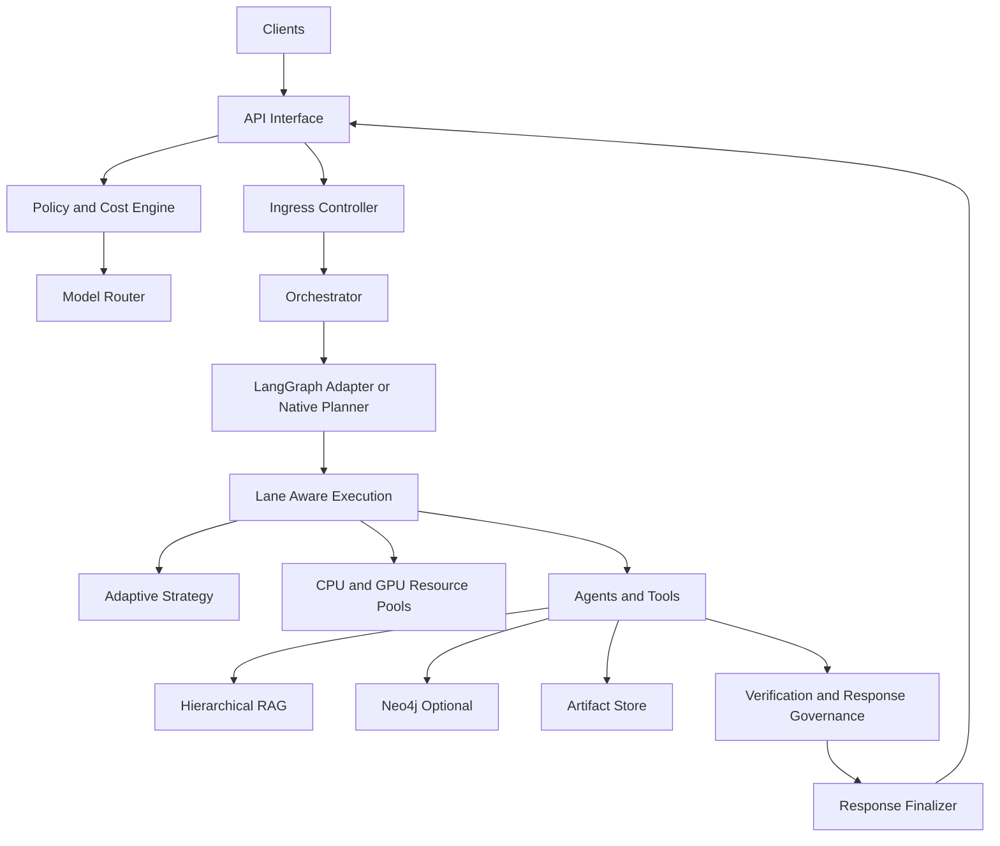

# RAG + Graph Runbook

## What this enables
- Hierarchical indexing (`document -> section -> chunk`) for retrieval.
- Context expansion using parent/sibling/child relationships.
- Multimodal node embeddings for both text and image-backed metadata.
- Optional Neo4j persistence for source/node relationships.
- Optional LangGraph-assisted workflow wave planning in orchestrator.

## Architecture (Current)


## Configuration
- `JARVIS_RESEARCH_HIERARCHICAL_RAG_ENABLED=true`
- `JARVIS_RESEARCH_VECTOR_STORE=memory|chroma`
- `JARVIS_RESEARCH_CHROMA_PATH=/Volumes/Jiten-2026/AI_SSD/ai-research/runtime/research/chroma`
- `JARVIS_RESEARCH_CHROMA_COLLECTION=jarvis_rag_nodes`
- `JARVIS_RESEARCH_STATE_PATH=/Volumes/Jiten-2026/AI_SSD/ai-research/runtime/research/state.json`
- `JARVIS_RESEARCH_NEO4J_ENABLED=false`
- `JARVIS_RESEARCH_NEO4J_URI=bolt://127.0.0.1:7687`
- `JARVIS_RESEARCH_NEO4J_USERNAME=neo4j`
- `JARVIS_RESEARCH_NEO4J_PASSWORD=<password>`
- `JARVIS_RESEARCH_NEO4J_DATABASE=neo4j`
- `JARVIS_RESEARCH_LANGGRAPH_ENABLED=false`
- `JARVIS_RESEARCH_LANGGRAPH_MAX_WAVE_SIZE=0`
- `JARVIS_AGENT_WORKFLOW_LANE_CAPS={"developer_lane":2,"analyst_lane":2,"manager_lane":1,"verifier_lane":1}`
- `JARVIS_AGENT_WORKFLOW_LANE_PRIORITY={"verifier_lane":10,"manager_lane":20,"analyst_lane":30,"developer_lane":40}`
- `JARVIS_AGENT_WORKFLOW_STEP_MAX_RETRIES=1`
- `JARVIS_AGENT_WORKFLOW_STEP_RESULT_CONTRACT_STRICT=true`
- `JARVIS_AGENT_TASK_PAYLOAD_CONTRACT_STRICT=true`
- `JARVIS_ORCH_MAX_PENDING_TASKS=2000`
- `JARVIS_AGENT_WORKFLOW_CHECKPOINT_BACKEND=file|sqlite`
- `JARVIS_AGENT_WORKFLOW_CHECKPOINT_PATH=data/workflow_checkpoints.json`
- `JARVIS_WORKFLOW_CHECKPOINT_RETENTION_DAYS=7`
- `JARVIS_RETENTION_RUN_INTERVAL_SECONDS=300`
- `JARVIS_POLICY_COST_ENABLED=true|false`
- `JARVIS_POLICY_COST_LEDGER_PATH=data/policy_cost_ledger.json`
- `JARVIS_ADAPTIVE_STRATEGY_ENABLED=true|false`
- `JARVIS_ADAPTIVE_STRATEGY_STATE_PATH=data/strategy_state.json`
- `JARVIS_ADAPTIVE_STRATEGY_PERSIST_EVERY=10`
- `JARVIS_POOL_CPU_SLOTS=6`
- `JARVIS_POOL_GPU_SLOTS=1`
- `JARVIS_POOL_GPU_ENABLED=true|false`
- `JARVIS_ARTIFACT_PERSIST_ENABLED=true|false`
- `JARVIS_ARTIFACT_PERSIST_PATH=data/artifacts`
- `JARVIS_ARTIFACT_RETENTION_DAYS=14`
- `JARVIS_INGRESS_ENABLED=true|false`
- `JARVIS_INGRESS_MAX_INFLIGHT=32`
- `JARVIS_INGRESS_MAX_QUEUE=128`
- `JARVIS_INGRESS_QUEUE_WAIT_TIMEOUT_MS=3000`
- `JARVIS_TOOL_ISOLATION_ENABLED=true|false`
- `JARVIS_TOOL_ALLOWED_ROOTS=/workspace,/runtime`
- `JARVIS_RESEARCH_EMBEDDING_BACKEND=local_deterministic` (`mlx_clip` optional)
- `JARVIS_RESEARCH_EMBEDDING_DIM=64`

## API checks
1. Ingest:
   - `POST /api/v1/research/ingest`
2. Query:
   - `POST /api/v1/research/query`
   - Verify `rag_context`, `graph_context` fields.
3. Tree inspection:
   - `GET /api/v1/research/tree/{source_id}`
4. Graph health:
   - `GET /api/v1/research/graph/health`
5. Quarantine review:
   - `GET /api/v1/research/quarantine?limit=100`
   - `POST /api/v1/research/quarantine/{source_id}/review` with `{"action":"approve|reject","reviewer":"...","reason":"..."}`
6. Operational mechanics status:
   - `GET /api/v1/status` to verify `ingress`, `tool_isolation`, `orchestrator.artifact_store`, and checkpoint retention counters.

## Import local dataset folders
Canonical local dataset root:
- `/Volumes/Jiten-2026/AI_SSD/ai-research/datasets`

Sync Hugging Face datasets from manifest:

```bash
python3 scripts/sync_hf_datasets.py \
  --manifest config/hf_datasets_manifest.txt \
  --dataset-root /Volumes/Jiten-2026/AI_SSD/ai-research/datasets
```

Download now, ingest later (HF clone only, no pulls on existing repos):

```bash
python3 scripts/sync_hf_datasets.py \
  --manifest config/hf_datasets_manifest.txt \
  --dataset-root /Volumes/Jiten-2026/AI_SSD/ai-research/datasets \
  --download-only
```

This also writes a dataset-domain index:
- `/Volumes/Jiten-2026/AI_SSD/ai-research/datasets/.jarvis_dataset_domains.json`

Use domain-specific manifests when needed:
- `config/hf_datasets_coding_manifest.txt`
- `config/hf_datasets_ops_manifest.txt`
- `config/hf_datasets_reasoning_manifest.txt`
- `config/hf_datasets_assistant_manifest.txt`
- `config/hf_datasets_domain_manifest.txt`
- `config/hf_datasets_agri_manifest.txt`

Non-HF agriculture source curation list:
- `config/agri_external_sources_manifest.txt`

Non-HF multi-domain source curation list:
- `config/non_hf_sources_multi_domain_manifest.txt`

Split non-HF domain manifests:
- `config/non_hf_sources_coding_manifest.txt`
- `config/non_hf_sources_ops_manifest.txt`
- `config/non_hf_sources_research_manifest.txt`
- `config/non_hf_sources_design_manifest.txt`
- `config/non_hf_sources_language_manifest.txt`
- `config/non_hf_sources_finance_legal_manifest.txt`
- `config/non_hf_sources_emotion_manifest.txt`
- `config/non_hf_sources_astro_manifest.txt`

You can pass multiple manifests in one run:

```bash
python3 scripts/sync_hf_datasets.py \
  --manifest config/hf_datasets_coding_manifest.txt config/hf_datasets_ops_manifest.txt \
  --dataset-root /Volumes/Jiten-2026/AI_SSD/ai-research/datasets
```

Use:

```bash
python3 scripts/import_local_dataset.py \
  /Volumes/Jiten-2026/AI_SSD/ai-research/datasets \
  --recursive \
  --topic react-code \
  --source-type official
```

Import later from downloaded HF datasets (domain tags auto-attached via `.jarvis_dataset_domains.json`):

```bash
python3 scripts/import_local_dataset.py \
  /Volumes/Jiten-2026/AI_SSD/ai-research/datasets \
  --recursive \
  --topic hf-datasets \
  --source-type official \
  --extensions .md,.txt,.json,.jsonl,.py,.js,.ts,.tsx,.yaml,.yml
```

Dry run:

```bash
python3 scripts/import_local_dataset.py \
  /Volumes/Jiten-2026/AI_SSD/ai-research/datasets \
  --recursive \
  --dry-run
```

Importer dedupe behavior:
- Keeps a local state file (`.jarvis_ingest_state.json`) under dataset root.
- Skips unchanged files and local duplicates across repeated runs.
- Reads dataset domain tags from `.jarvis_dataset_domains.json` and attaches
  `dataset_id`, `domain_tags`, and `domain_primary` metadata to ingest items.
- Image metadata keys supported during ingest for multimodal indexing:
  `image_b64` / `image_base64` / `image_bytes_b64` / `image_path`,
  plus optional `image_title` and `image_caption`.
- Ingest quality policy auto-quarantines low-signal items (short/low-topic-fit/low-trust) and keeps them out of retrieval until reviewed.

## Phase 13 evaluation scaffold
Generate a domain-evaluation template/report:

```bash
python3 scripts/eval_phase12.py --out /tmp/phase12_eval.json
```

## Import non-HF URLs
Dry run:

```bash
python3 scripts/import_non_hf_sources.py \
  --manifest config/non_hf_sources_coding_manifest.txt config/non_hf_sources_ops_manifest.txt \
  --dry-run
```

Ingest:

```bash
python3 scripts/import_non_hf_sources.py \
  --manifest config/non_hf_sources_multi_domain_manifest.txt config/agri_external_sources_manifest.txt \
  --topic external-sources
```

Download now, ingest later (no API required):

```bash
python3 scripts/import_non_hf_sources.py \
  --manifest config/non_hf_sources_multi_domain_manifest.txt config/agri_external_sources_manifest.txt \
  --download-only \
  --download-root /Volumes/Jiten-2026/AI_SSD/ai-research/datasets/non_hf_sources
```

If some sources block generic requests, retry with a stronger user-agent and SSL fallback:

```bash
python3 scripts/import_non_hf_sources.py \
  --manifest config/non_hf_sources_multi_domain_manifest.txt config/agri_external_sources_manifest.txt \
  --download-only \
  --download-root /Volumes/Jiten-2026/AI_SSD/ai-research/datasets/non_hf_sources \
  --user-agent "JARVIS Research Loader (local; contact: you@example.com)" \
  --insecure-ssl
```

Failed URLs are exported to:
- `data/non_hf_failed_urls_manifest.txt`

## Rollback
1. Set:
   - `JARVIS_RESEARCH_HIERARCHICAL_RAG_ENABLED=false`
   - `JARVIS_RESEARCH_NEO4J_ENABLED=false`
   - `JARVIS_RESEARCH_LANGGRAPH_ENABLED=false`
   - `JARVIS_RESEARCH_LANGGRAPH_MAX_WAVE_SIZE=0`
   - `JARVIS_AGENT_WORKFLOW_LANE_CAPS={"developer_lane":2,"analyst_lane":2,"manager_lane":1,"verifier_lane":1}`
   - `JARVIS_AGENT_WORKFLOW_LANE_PRIORITY={"verifier_lane":10,"manager_lane":20,"analyst_lane":30,"developer_lane":40}`
   - `JARVIS_AGENT_WORKFLOW_STEP_MAX_RETRIES=1`
   - `JARVIS_AGENT_WORKFLOW_STEP_RESULT_CONTRACT_STRICT=true`
   - `JARVIS_AGENT_TASK_PAYLOAD_CONTRACT_STRICT=true`
   - `JARVIS_AGENT_WORKFLOW_CHECKPOINT_BACKEND=sqlite`
   - `JARVIS_AGENT_WORKFLOW_CHECKPOINT_PATH=data/workflow_checkpoints.json`
   - `JARVIS_POLICY_COST_ENABLED=true`
   - `JARVIS_POLICY_COST_LEDGER_PATH=data/policy_cost_ledger.json`
   - `JARVIS_ADAPTIVE_STRATEGY_ENABLED=true`
   - `JARVIS_POOL_CPU_SLOTS=6`
   - `JARVIS_POOL_GPU_SLOTS=1`
   - `JARVIS_POOL_GPU_ENABLED=true`
2. Restart API service.
3. Continue using standard research ranking without hierarchical/graph augmentation.

## Validation status
- Local full test suite validation (2026-03-21):
  - `source ~/ai-envs/mlx-env/bin/activate && pytest -q`
  - `208 passed, 1 warning`
